  

I build and ship web applications. Six of my projects are live and publicly accessible.
Currently strengthening my Java and DSA fundamentals for placements.

📍 Mathura, Uttar Pradesh, India

## Featured Projects

| Project | What it does | Live |
|---|---|---|
| **Mithaas** | Premium sweets e-commerce storefront with product catalogue, cart and checkout flow | [Visit](https://stitchmithaaspremiumconfectioneryex.vercel.app) · [Code](https://github.com/jugendrapratap04-max/mithaas-sweets) |
| **Etudo** | Multi-subject learning platform; lessons plus in-browser Python and SQL practice | [Visit](https://dataquest-navy.vercel.app) · [Code](https://github.com/jugendrapratap04-max/dataquest) |
| **NEEV Web Studio** | Template shop selling ready-made websites to small Indian businesses | [Visit](https://neev-5h1.pages.dev) · [Code](https://github.com/jugendrapratap04-max/neev) |
| **FEARLESS ESPORTS** | BGMI tournament platform with slot booking and match management | [Visit](https://fearless-esports.vercel.app) |
| **Aamvan Orchards** | Mango orchard business site with product pages and enquiry flow | [Visit](https://aamvan-orchards.vercel.app) · [Code](https://github.com/jugendrapratap04-max/aamvan-orchards) |
| **Portfolio** | My personal site, fully driven by a single config file | [Visit](https://jugendra-pratap.vercel.app) · [Code](https://github.com/jugendrapratap04-max/portfolio) |

## Tech Stack

## GitHub Activity

<picture>
  <source media="(prefers-color-scheme: dark)" srcset="https://raw.githubusercontent.com/jugendrapratap04-max/jugendrapratap04-max/output/github-snake-dark.svg">
  <source media="(prefers-color-scheme: light)" srcset="https://raw.githubusercontent.com/jugendrapratap04-max/jugendrapratap04-max/output/github-snake.svg">
  
</picture>

## Contact

- Portfolio — [jugendra-pratap.vercel.app](https://jugendra-pratap.vercel.app)
- LinkedIn — [jugendra-pratap-ds](https://www.linkedin.com/in/jugendra-pratap-ds/)
- Email — [jugendrapratap04@gmail.com](mailto:jugendrapratap04@gmail.com)

Open to internship and placement opportunities.
